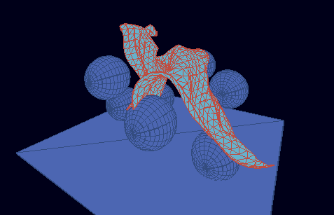

# Cloth playground

This is a simple implementation of cloth physics in C++, with the
scene scriptable via [Lua](http://lua.org), rendered using OpenGL.

## Description

This project aims to create a scriptable playground for cloth
simulation. It also serves as a playground for embedding Lua.

The simulation is done using a method similar to that described in
[this 2001 paper][1]. Inspiration was partly taken from the
[GLSL cloth example][2] from the NVIDIA Graphics SDK 9.5.

## Dependencies

The project uses:
 - [Cmake](http://cmake.org)
 - OpenGL
 - [GLEW](http://glew.sourceforge.net/)
 - [GLM](http://glm.g-truc.net/) (bundled)
 - [GLUT](http://freeglut.sourceforge.net/)
 - [Lua](http://lua.org) (bundled)

## Building on Windows

Prebuild GLUT binaries can be downloaded
[here](http://www.transmissionzero.co.uk/software/freeglut-devel/). GLEW
binaries are provided on
[the project page](http://glew.sourceforge.net/).

The script `build-w32.cmd` serves as a reference on how to build the
code under Windows.

If you use Visual Studio 2008, the script should work after tweaking
the `GLUT_PATH` and `GLEW_PATH` variables. Contributions for automated
builds using other versions of Visual Studio are welcome.

## Building on GNU/Linux

After installing GLEW and GLUT the build process should be as easy as:

    mkdir build
    cd build
    cmake ..
    make

The script `build.sh' is provided for reference and convenience.

## Running the demo

Once you have a `cloth-playground` executable you can run it as

    cloth-playground [scene.lua]

for example:

    cloth-playground sample-scenes/sphere_test.lua

The mouse rotates the camera, Space stands for pause/unpause.

## License

Copyright (c) 2012 Taras Shpot, distributed under the BSD license.

[1]: http://graphics.cs.cmu.edu/nsp/course/15-869/2006/papers/jakobsen.htm
[2]: http://developer.download.nvidia.com/SDK/9.5/Samples/samples.html#glsl_physics
